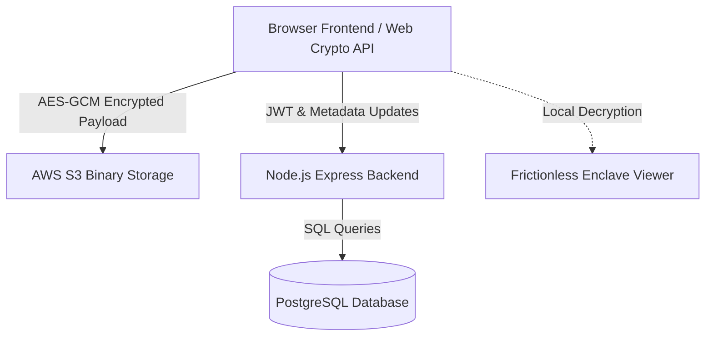

# SecureVault: Hyper-Secured, Frictionless Encrypted Data Sanctuary

SecureVault is an ultra-premium, Zero-Knowledge file storage and sharing web application designed for absolute privacy and seamless operations. It integrates local-first browser cryptography with cloud-backed metadata coordination, offering safe record management, secure time-decaying shared links, and high-fidelity, in-browser document previews.

---

## 🌟 Key Architecture & Pillars

SecureVault is engineered around three core paradigms:
1. **Zero-Knowledge Design**: Unencrypted files and master passcodes never leave the client's device. Cryptographic keys are derived, and files are encrypted/decrypted entirely in the browser using the browser's native Web Crypto API.
2. **Frictionless Enclave Preview**: Rather than forcing downloads, SecureVault parses and renders binary formats (`.pdf`, `.docx`, `.xlsx`, code files, media, and zip structures) directly inside a responsive document viewer in the browser.
3. **Dynamic Interactive UI**: Built with pure HTML5, vanilla CSS, and ES6 JavaScript, the desktop layout provides detailed navigation panels, while the mobile view automatically adapts into a modern, floating bottom capsule bar (Telegram-style) with inline profile navigation.



---

## 🛠 Tech Stack

### Frontend (Client Enclave)
* **Core**: Semantic HTML5, Vanilla CSS3 (Custom gradients, glassmorphism, responsive media queries), and Vanilla JavaScript (ES6+).
* **Cryptographic Core**: Web Crypto API (`AES-GCM` 256-bit encryption, `PBKDF2` key derivation, `SHA-256` hashing).
* **Document Rendering Engines**:
  * **Mammoth.js**: For client-side compilation and rendering of Word Documents (`.docx`) into clean HTML.
  * **SheetJS (XLSX)**: For parsing Excel workbooks (`.xlsx`) and injecting them into interactive spreadsheet grids.
  * **PDF.js**: For rendering document pages onto HTML5 canvas nodes.
  * **JSZip**: For dynamically packing folder directories into zip files client-side.
  * **Highlight.js**: For rendering syntax-highlighted code containers for programming sources (`.html`, `.css`, `.js`, `.py`, `.json`, etc.).

### Backend (Metadata Coordinator)
* **Server Runtime**: Node.js & Express.
* **Database Driver**: `pg` (PostgreSQL client pool).
* **File Stream Bridge**: `aws-sdk` (AWS S3 Integration).
* **Encryption Helpers**: `bcryptjs` (password hashing) and `jsonwebtoken` (stateless JWT session tokens).
* **Mailer Protocol**: `nodemailer` (Gmail SMTP integration for identity verification and password recovery).

---

## 🗄 Database Schema Design

SecureVault relies on a relational PostgreSQL database to synchronize account configurations and encrypted file indices.

### Entity Relationship & Tables

| Table Name | Description | Key Attributes |
| :--- | :--- | :--- |
| `users` | Stores accounts, bcrypt passwords, and reference master key envelopes. | `user_id` (PK), `username`, `email` (Unique), `password_hash`, `security_pin_hash`, `profile_photo`, `client_master_key` |
| `files` | Indexes vault uploads, soft-deletion status, and ownership references. | `file_id` (PK), `file_uuid` (UUID), `owner_id` (FK), `file_type`, `is_deleted`, `deleted_at`, `folder_id` (FK) |
| `file_metadata` | Stores client-side encrypted filename/size payload under AES-GCM IV bounds. | `file_id` (FK), `encrypted_metadata` (Bytea), `iv` (Text) |
| `file_keys` | Stores individual file symmetric keys, encrypted under the owner's derived key. | `file_id` (FK), `encrypted_key` (Text) |
| `user_keys` | Escrows intermediate encrypted vault keys to manage profile key swaps. | `user_id` (PK, FK), `encryption_key` (Text) |
| `folders` | Coordinates user-defined virtual directories. | `folder_id` (PK), `owner_id` (FK), `name` |
| `shared_links` | Manages time-decaying shared files, download limitations, and expiration dates. | `link_id` (PK), `file_id` (FK), `recipient_email`, `token_hash`, `encrypted_file_key`, `encrypted_metadata`, `iv`, `is_used`, `downloadable`, `expires_at` |
| `audit_logs` | Logs user operations in real-time (e.g. Upload, Download, Delete, Key Swaps). | `log_id` (PK), `user_id` (FK), `file_id` (FK), `action`, `details` |
| `otp_store` | Holds dynamic temporal verification hashes for SMTP-based validation. | `email` (PK), `otp_hash`, `expires_at` |
| `recovery_tokens` | Tracks secondary validation states for resetting master passcodes. | `token_id` (PK), `user_id` (FK), `token_hash`, `type`, `expires_at` |

---

## 🔒 Security & Cryptographic Handshake

SecureVault enforces local-first encryption. The step-by-step cryptographic sequence is as follows:

### 1. Key Derivation (Registration & Login)
1. The user inputs their **Email** and **Master Passcode**.
2. The frontend inputs the passcode through a slow hash derivation cycle (`PBKDF2`, `100,000 iterations`, `SHA-256`, using email as salt) to generate:
   - **Auth Hash**: Sent to the server for authentication (hashed on the server with `bcrypt`).
   - **Vault Key**: Kept in-memory in the browser. It is never sent to the server.

### 2. Vault File Encryption (Upload)
1. A cryptographically secure random **File Key** (256-bit AES symmetric key) is generated in the browser.
2. The file payload is encrypted locally with the **File Key** using `AES-GCM`.
3. The **File Key** is encrypted with the user's **Vault Key** using `AES-GCM` to produce `encrypted_key`.
4. The file metadata (name, size, type) is encrypted with the user's **Vault Key**.
5. The frontend transmits:
   - The encrypted file payload (sent to the backend, which streams it to **AWS S3**).
   - The `encrypted_key`, encrypted metadata, and cryptographically random initialization vectors (`iv`) to be saved in the database.

### 3. Vault File Decryption (Viewing)
1. The frontend fetches the encrypted file binary stream from S3, alongside the database record containing `encrypted_key`, encrypted metadata, and `iv`.
2. The browser decrypts `encrypted_key` using the user's in-memory **Vault Key**.
3. Using the decrypted **File Key**, the browser decrypts the file payload in real-time and streams it into the document viewer.

---

## 📱 Mobile Optimizations

SecureVault features an adaptive design, ensuring high performance on desktop, tablet, and mobile screens:

* **Telegram-Style Bottom Capsule**: On screens narrower than `768px`, the sidebar transforms into a floating bottom pill-shaped capsule (`border-radius: 36px`, `backdrop-filter: blur(20px)`). All 5 main navigation links are laid out vertically as compact tabs inside this capsule.
* **Header Optimization**: The user profile badge and avatar align dynamically next to the active view title inside the main header layout, replacing the fixed top-right corner desktop layout.
* **Clearance Padding**: Content elements include `padding-bottom: 110px` on mobile viewports, ensuring scrollable records are never hidden behind the floating bottom bar.
* **Layout Shifts**: Table structures automatically adapt into interactive card grids, optimizing tap interactions.

---

## ⚙️ Installation & Configuration

### Prerequisites
* **Node.js** (v18.x or higher)
* **PostgreSQL Database**
* **AWS S3 Bucket** (for file payloads)
* **Gmail Account** (or SMTP account for notifications)

### 1. Configuration Setup
Navigate to the `/backend` directory, duplicate the `.env.example` file, and name it `.env`:
```bash
cp backend/.env.example backend/.env
```
Open `.env` and configure your credentials:
* **PostgreSQL Connection**: Host, user, port, and password.
* **AWS S3 Bucket Integration**: AWS Access Keys, S3 region, and bucket name.
* **Stateless JWT Secret**: Unique hash for signing cookies/session parameters.
* **Gmail App Password**: Notification sender account credentials.

> [!WARNING]
> Ensure `.env` is listed in your `.gitignore` file. Never commit credentials to version control.

### 2. Backend Installation & Run
Install npm packages and spin up the backend:
```bash
cd backend
npm install
npm run dev
```
Upon launching, the backend automatically initializes the database tables and runs the required structural migrations.

### 3. Frontend Run
The frontend is built with vanilla files and can be hosted using any basic static web server. For local development, run a lightweight static server from the `/frontend` directory:
```bash
cd frontend
# Example using Python
python -m http.server 3000
# Or using npm serve
npx serve -l 3000
```
Visit `http://localhost:3000` in your browser.

---

## 🧹 Maintenance & Background Tasks

SecureVault includes an automated server-side cleanup task inside `server.js`:
* **Recycle Bin Pruning**: Runs hourly. It queries the database for files marked as deleted (`is_deleted = TRUE`) that have been in the recycle bin for longer than **7 days**.
* **AWS S3 Sync**: The cleanup script deletes the encrypted objects directly from AWS S3, and removes the corresponding rows from the database.

---
*Engineered for Absolute Confidentiality & Seamless Vault Access.*
