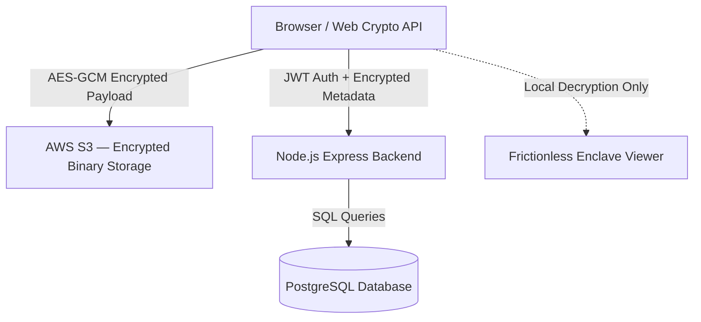

# SecureVault
### Hyper-Secured, Zero-Knowledge Encrypted File Vault

SecureVault is an ultra-premium, end-to-end encrypted file storage and secure sharing web application. Files are encrypted and decrypted **entirely in the browser** using the Web Crypto API — the server and database never see your plaintext data or master passcode. Built with pure HTML5, Vanilla CSS3, and ES6 JavaScript on the frontend, and Node.js + Express + PostgreSQL + AWS S3 on the backend.

---

## Architecture Overview



The server **never** receives raw file content, filenames, or the master passcode. All cryptographic operations happen client-side.

---

## Feature Set

### 🔒 Zero-Knowledge Encryption
- Files and metadata are encrypted with **AES-GCM 256-bit** before leaving the browser
- Master passcode is put through **PBKDF2** (100,000 iterations, SHA-256) to derive:
  - An **Auth Hash** (sent to server, re-hashed with bcrypt)
  - A **Vault Key** (kept in memory only, never transmitted)
- Individual **File Keys** are generated per-file and encrypted under the Vault Key
- **The server cannot decrypt any stored file — ever**

### 📁 DataVault — Encrypted File Manager
- Upload any file type directly from the browser
- Files are streamed to **AWS S3** in encrypted form via pre-signed S3 URLs
- **Folder organization** — create virtual directories, move files between them
- Real-time file list with skeleton loaders during async operations
- Batch operations: select multiple files, download, share, or delete at once

### 📥 Incoming Data — Shared File Inbox
- Receive files shared to your registered email address
- Instant load from **sessionStorage cache** — zero network wait on revisit
- Silent background refresh to pick up new shares
- Unlock shared files in-browser with the Frictionless Enclave Viewer

### 🗑️ Recycle Bin — 7-Day Retention
- Deleted files enter a 7-day retention buffer before permanent purge
- Restore or permanently delete from Recycle Bin at any time
- Server-side hourly cleanup task prunes expired records from both S3 and PostgreSQL
- Skeleton loaders display immediately on tab switch

### 👁️ Frictionless Enclave Viewer
Files are decrypted and rendered **in-browser** with zero downloads required:

| File Type | Renderer |
|---|---|
| PDF | PDF.js — page-by-page canvas rendering |
| Word Documents (.docx) | Mammoth.js — clean HTML conversion |
| Excel Workbooks (.xlsx) | SheetJS — interactive grid view |
| Code Files (.js, .py, .html, .css, .json, etc.) | Highlight.js — syntax highlighting |
| Images (PNG, JPG, SVG, WebP, GIF) | Native browser preview |
| Video (MP4, MKV, MOV) | HTML5 `<video>` player |
| Audio (MP3, WAV, AAC, FLAC) | HTML5 `<audio>` player |
| ZIP Archives | JSZip — file tree listing |

### 🔗 Secure Sharing
- Share files with any registered SecureVault user via their email
- Each share generates an **encrypted file key** unique to the recipient — the sender's Vault Key is never shared
- Optional **download permission** toggle per share
- Time-decaying share links: marked `is_used` after first unlock for burn-after-reading flows
- Bulk share / delete from the selection toolbar

### 🌓 Dual Theme System
- **Light Theme** (default): clean white + dark navy sidebar
- **Dark Theme**: pure `#000000` background with high-contrast elements
- Theme preference synced to the database — persists across sessions and devices
- Theme toggle available in the Settings (Profile) section

### 📱 Mobile-Optimized UI
- On screens ≤ 768px, the desktop sidebar transforms into a **floating bottom capsule bar**
  - Pill-shaped (`border-radius: 26px`), dark-navy translucent (`backdrop-filter: blur(20px)`)
  - 4 navigation tabs (DataVault, Incoming Data, Recycle Bin, Settings) evenly distributed with `space-evenly`
  - No exit/logout button in the mobile capsule
- Recycle Bin search bar stacks vertically below the title on mobile for full-width usability
- Profile section metadata cards adapt to single-column on mobile
- Header scrolls naturally on all views including the Help overlay

### 🛡️ Screenshot & Content Protection
SecureVault implements 5 layers of capture prevention:

| Layer | Blocks |
|---|---|
| `@media print` CSS | Print to PDF, browser print dialog |
| Keyboard interceptor (capture phase) | `PrtSc`, `Ctrl+P`, `Ctrl+U`, `Ctrl+Shift+I/J/S`, macOS `⌘+Shift+3/4/5` |
| Right-click block | Context menu disabled inside the secure dashboard |
| Drag block | Content cannot be dragged out of the page |
| Visibility/blur overlay | Full-screen black lock screen appears when the window loses focus or tab goes to background — covers Snipping Tool, alt-tab captures, and mobile app-switch screenshots |

> **Note:** OS-level hardware screenshot buttons (e.g. Android/iOS volume+power) cannot be blocked by browser technology. This is a sandbox limitation.

### 🔐 Identity & Security
- **OTP Email Verification** for new account registration
- **Security PIN** (4 or 6 digits) as a second credential layer
- **Email-based Recovery** — 15-minute expiring recovery tokens sent via Gmail SMTP
- **Password Change** — requires current password confirmation
- **Profile Photo** — base64-encoded, stored in the database
- **Audit Log** — every upload, download, delete, and share is logged server-side

### ⚡ Performance
- **Zero-lag cached rendering**: DataVault, Incoming Data, and Recycle Bin all render from `sessionStorage` cache immediately, then silently refresh in the background
- **Preserved crypto cache**: Already-decrypted file metadata is cached in memory to avoid redundant crypto cycles on re-renders
- **Skeleton loaders**: Displayed immediately on every view switch before data arrives
- **Pre-signed S3 URLs**: File uploads go directly from browser → S3, bypassing the backend entirely for binary payloads

---

## Database Schema

| Table | Description |
|---|---|
| `users` | Accounts, bcrypt password hashes, security PIN hashes, profile photos |
| `files` | File index with soft-delete, recycle bin, and folder assignment |
| `file_metadata` | AES-GCM encrypted filenames/sizes (stored as BYTEA) |
| `file_keys` | Per-file symmetric keys, encrypted under the owner's Vault Key |
| `user_keys` | Encrypted Vault Keys (one per user) |
| `folders` | User-defined virtual directories |
| `shared_links` | Encrypted file shares with recipient email, burn-after-read flag, download permission |
| `audit_logs` | Append-only log of all file operations |
| `otp_store` | Temporary OTP hashes for email verification (10-minute TTL) |
| `recovery_tokens` | Short-lived password/PIN reset tokens (15-minute TTL) |

---

## Tech Stack

### Frontend
- **Core**: Semantic HTML5, Vanilla CSS3, ES6+ JavaScript (no frameworks)
- **Crypto**: Web Crypto API — `AES-GCM` 256-bit, `PBKDF2`, `SHA-256`
- **Libraries** (CDN-loaded):
  - `PDF.js` — PDF rendering
  - `Mammoth.js` — DOCX → HTML
  - `SheetJS (XLSX)` — Excel rendering
  - `JSZip` — ZIP inspection
  - `Highlight.js` — Code syntax highlighting

### Backend
- **Runtime**: Node.js 18+, Express 5
- **Database**: PostgreSQL via `pg` connection pool
- **File Storage**: AWS S3 via `aws-sdk` (pre-signed URL pattern)
- **Auth**: `jsonwebtoken` (7-day JWT), `bcryptjs` (password/PIN hashing)
- **Email**: `nodemailer` with Gmail SMTP
- **Security**: CORS, `trust proxy` for Vercel deployment

---

## Installation & Setup

### Prerequisites
- Node.js v18+
- PostgreSQL database (local or cloud — Supabase, Neon, Railway)
- AWS S3 bucket
- Gmail account with App Password enabled

### 1. Clone & Configure

```bash
git clone https://github.com/Adidam-Akshay-Bhaskar/SecureVault.git
cd SecureVault
```

Copy the environment template:
```bash
cp backend/.env.example backend/.env
```

Edit `backend/.env` and fill in all values:
```
DB_HOST=...
DB_USER=...
DB_PASSWORD=...
DB_NAME=...
DB_PORT=5432

AWS_ACCESS_KEY_ID=...
AWS_SECRET_ACCESS_KEY=...
AWS_REGION=...
S3_BUCKET_NAME=...

JWT_SECRET=your_very_long_random_secret

SYSTEM_EMAIL=your@gmail.com
SYSTEM_EMAIL_PASS=your_gmail_app_password

FRONTEND_URL=http://localhost:3000
```

> [!WARNING]
> **Never commit `.env` to version control.** The `.gitignore` already excludes it.

### 2. Install & Start Backend

```bash
cd backend
npm install
npm start        # production
# or
npm run dev      # development with nodemon
```

The backend auto-creates and migrates all database tables on first startup. It also starts the hourly recycle bin cleanup task immediately.

### 3. Open Frontend

The backend serves the frontend statically. Visit:
```
http://localhost:3000
```

No separate frontend build step is required.

---

## Deployment

The project includes a `vercel.json` for one-click deployment to **Vercel**:
- All routes forward to `backend/server.js`
- Static frontend files are served by Express
- Set all environment variables in the Vercel project dashboard

---

## Project Structure

```
SecureVault/
├── backend/
│   ├── server.js          # Express API, DB schema, S3 integration, auth, cleanup
│   ├── package.json
│   └── .env.example       # Environment variable template
├── frontend/
│   ├── index.html         # Single-page app shell (all views)
│   ├── app.js             # All client logic: crypto, UI, API calls, file viewer
│   ├── style.css          # Complete design system: light theme, dark theme, mobile
│   ├── favicon.png
│   └── images/            # UI preview screenshots
├── .gitignore
├── vercel.json
└── README.md
```

---

## Background Tasks

| Task | Interval | Action |
|---|---|---|
| Recycle Bin Pruning | Every 1 hour | Deletes S3 objects and DB rows for files deleted > 7 days ago |
| OTP Cleanup | On each OTP request | Expired OTPs replaced via `ON CONFLICT DO UPDATE` |
| Recovery Token Cleanup | On each reset execution | Tokens deleted immediately after use |

---

## Security Notes

- The master passcode is **never stored** anywhere — not in the browser, not in the database
- The derived Vault Key lives only in `sessionStorage` and is wiped on logout
- All file content, filenames, and metadata sizes are opaque to the server
- JWT tokens expire after 7 days
- Security PIN is stored as a bcrypt hash (separate from the master passcode)
- S3 objects use UUID filenames — no relationship to the original filename is stored in plain text

---

*Built with precision. Engineered for absolute confidentiality.*
